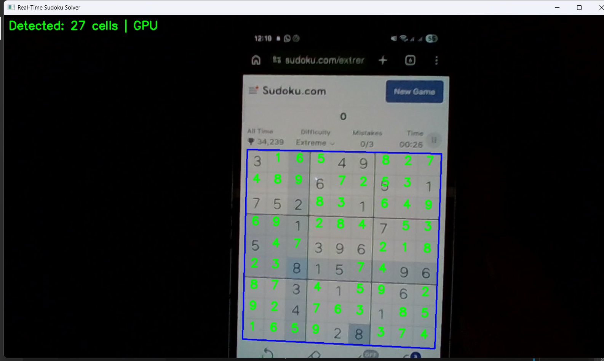

# Real-Time Sudoku Solver (PyTorch + OpenCV)

Real-time Sudoku detection and solving from webcam video using:

- OpenCV for board detection, perspective warping, and cell extraction
- A lightweight PyTorch CNN for digit OCR (classes: `0-9`, where `0` means empty)
- Probability-guided Sudoku backtracking instead of hard OCR-only clues

The project includes offline training and two real-time inference pipelines.


## Features

- Real-time Sudoku grid detection from webcam frames
- Digit probability estimation per cell with temporal smoothing across frames
- Robust solving using candidate sets derived from OCR probabilities
- Optional OpenCL acceleration for some OpenCV operations (`UMat` path)
- PyTorch model inference on CPU or CUDA (if available)
- On-screen runtime metrics: FPS, solve latency, OCR confidence

## Project Structure

- `train_model.py`: trains `DigitCNN` on synthetic printed digits and saves `digit_cnn.pth`
- `main.py`: baseline real-time pipeline (single-cell inference loop)
- `main_batched.py`: optimized real-time pipeline (batched 81-cell inference + extra runtime tuning keys)
- `test_model_load.py`: quick sanity check for model loading and forward pass
- `side.py`: reports OpenCV GPU/OpenCL capability information
- `digit_cnn.pth`: trained model weights (generated or pre-existing)

## Requirements

- Python `>= 3.14` (as declared in `pyproject.toml`)
- Webcam connected and accessible by OpenCV
- `uv` package manager installed

## Installation

Install runtime dependencies:

```bash
uv sync
```

Install optional training extras:

```bash
uv sync --extra training
```

## Train the CNN

Run:

```bash
uv run train_model.py
```

What this does:

- Generates synthetic printed digit data (plus empty-cell negatives)
- Trains a compact CNN for 50 epochs
- Writes model weights to `digit_cnn.pth`

## Run the Solver

Baseline pipeline:

```bash
uv run main.py
```

Batched/optimized pipeline (recommended):

```bash
uv run main_batched.py
```

Press `q` to quit.

## Runtime Controls

In `main_batched.py`:

- `[` / `]`: decrease/increase corner drift tolerance
- `-` / `=` (or `+`): decrease/increase solution persistence frames
- `q`: quit

In `main.py`:

- `q`: quit

## Quick Validation

Validate that the saved model loads and runs inference:

```bash
uv run test_model_load.py
```

Check OpenCV/OpenCL runtime capabilities:

```bash
uv run side.py
```

## How It Works (High Level)

1. Capture frame from webcam.
2. Convert to grayscale, apply CLAHE and adaptive thresholding.
3. Detect the Sudoku contour and warp to a normalized 9x9 grid image.
4. Extract each cell, isolate digit components, and prepare 28x28 model inputs.
5. Run CNN inference to get digit probabilities per cell.
6. Smooth probabilities over recent frames for stability.
7. Build candidate sets per cell and solve using backtracking with probability ordering.
8. Overlay solved digits back onto the original camera frame.

## Notes

- `digit_cnn.pth` must exist before running `main.py` or `main_batched.py`.
- If OpenCL is unavailable, OpenCV steps automatically fall back to CPU.
- If CUDA is unavailable, PyTorch inference runs on CPU automatically.
- The solver requires a sufficient number of valid clues before attempting full solve.

## Troubleshooting

- `Missing model: ... digit_cnn.pth`: run `uv run train_model.py` first.
- Webcam not opening: verify camera permissions and that no other app is locking it.
- Slow performance: use `main_batched.py`, ensure OpenCL/CUDA availability, and reduce background system load.

## License

No license file is currently included in this repository.

